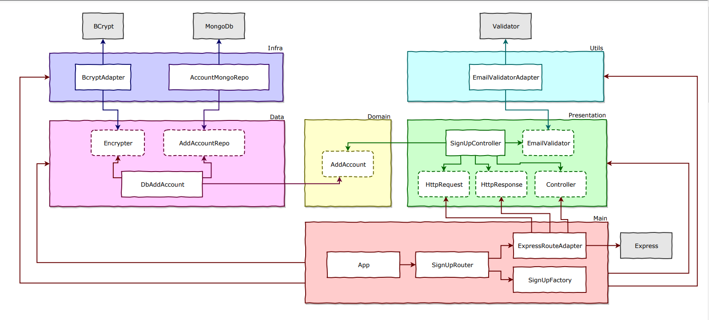

## Roadmap

NodeJs, Typescript, TDD, DDD, Clean Architecture e SOLID
 
 

Diagrama:

Cronograma de aulas:
- [ ✅ ] 001 - Introdução
- [ ❌ ] 002 - SignUp API - Presentation Layer
- [ ❌ ] 003 - Jest
- [ ❌ ] 004 - Utils Layer
- [ ❌ ] 005 - SignUp API - Data Layer
- [ ❌ ] 006 - SignUp API - Infra Layer
- [ ❌ ] 007 - SignUp API - Main Layer
- [ ❌ ] 008 - Log de Erro
- [ ❌ ] 009 - Login API - Presentation Layer
- [ ❌ ] 010 - Login API - Data Layer
- [ ❌ ] 011 - Segurança - HashEncryptEncode
- [ ❌ ] 012 - Login API - Infra Layer  
- [ ❌ ] 013 - Login API - Main Layer
- [ ❌ ] 014 - Docker
- [ ❌ ] 015 - SignUp API - Ajustes
- [ ❌ ] 016 - AddSurvy API
- [ ❌ ] 017 - Criando Middleware de Autenticação
- [ ❌ ] 018 - CI & CD
- [ ❌ ] 019 - LoadSurveys API
- [ ❌ ] 020 - Paths no Typescript
- [ ❌ ] 021 - SaveSurveyResult API
- [ ❌ ] 022 - Refactor
- [ ❌ ] 023 - Swagger
- [ ❌ ] 024 - LoadSurveyResult API
- [ ❌ ] 025 - Refactor
- [ ❌ ] 026 - Melhorando a Arquitetura 
- [ ❌ ] 027 - GraphQL
- [ ❌ ] 028 - Atualizando Libs